# Fine-grained Bird Species Recognition with Vision Transformer (ViT)

An end-to-end MLOps project for fine-grained bird species classification using a Vision Transformer (ViT-B/16). The system classifies 50 bird species from the CUB-200-2011 dataset and is deployed as a production-ready microservices application on Google Kubernetes Engine (GKE) with a full observability stack.

---

## Table of Contents

- [High-Level Architecture](#high-level-architecture)
- [Tech Stack](#tech-stack)
- [Project Structure](#project-structure)
- [Model Details](#model-details)
- [Services](#services)
  - [API (FastAPI)](#api-fastapi)
  - [Frontend (Streamlit)](#frontend-streamlit)
  - [Model Serving (KServe + TorchServe)](#model-serving-kserve--torchserve)
- [Getting Started](#getting-started)
  - [Prerequisites](#prerequisites)
  - [Local Development with Docker Compose](#local-development-with-docker-compose)
  - [Environment Variables](#environment-variables)
- [Training](#training)
- [Model Packaging (MAR Archive)](#model-packaging-mar-archive)
- [Kubernetes Deployment](#kubernetes-deployment)
  - [Infrastructure Setup (GCP)](#infrastructure-setup-gcp)
  - [Helm Charts](#helm-charts)
- [CI/CD Pipeline](#cicd-pipeline)
- [Observability](#observability)
- [Testing](#testing)

---

## High-Level Architecture

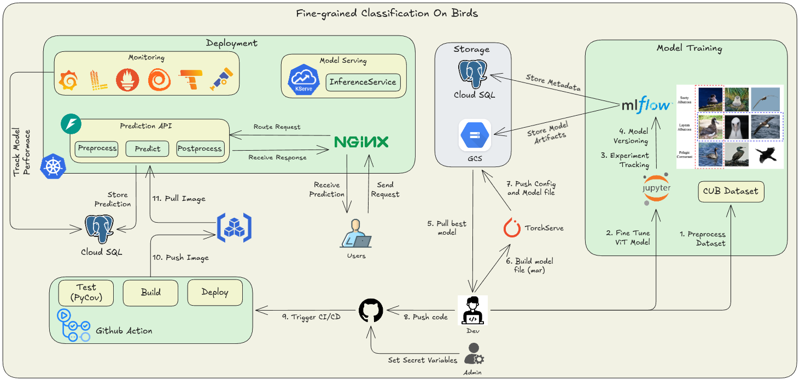

---

## Tech Stack

| Layer                    | Technology                                                                 |
| ------------------------ | -------------------------------------------------------------------------- |
| **ML Framework**         | PyTorch, torchvision (ViT\_B\_16), Ultralytics YOLOv8                      |
| **Experiment Tracking**  | MLflow (PostgreSQL backend + GCS artifact storage)                         |
| **Model Serving**        | KServe InferenceService with TorchServe (MAR archives, v2 protocol)        |
| **API Backend**          | FastAPI + Uvicorn                                                          |
| **Frontend**             | Streamlit                                                                  |
| **Database**             | PostgreSQL (predictions storage for model performance drift tracking)      |
| **Observability**        | Grafana, Loki (logs), Tempo (traces), Prometheus (metrics), Alloy (collector), OpenTelemetry (emit signals) |
| **Tracing**              | OpenTelemetry (OTLP gRPC export) — instrumented in both API and Frontend   |
| **Logging**              | structlog (JSON format with OTel trace ID injection for log↔trace correlation) |
| **Infrastructure**       | GCP (GKE Autopilot, Cloud SQL, GCS, Artifact Registry)                    |
| **Containerization**     | Docker, Docker Compose                                                     |
| **Orchestration**        | Kubernetes + Helm                                                          |
| **CI/CD**                | GitHub Actions                             |
| **Package Management**   | uv (Astral) — monorepo workspace                                          |
| **Code Quality**         | flake8, isort, pre-commit                                                  |

---

## Project Structure

```
.
├── .github/workflows/
│   └── ci-cd.yml                                # GitHub Actions CI/CD pipeline
├── k8s/helm/                                    # Helm charts for Kubernetes deployment
│   ├── api/                                     # FastAPI backend
│   ├── frontend/                                # Streamlit frontend
│   ├── serving/                                 # KServe InferenceService
│   ├── grafana/                                 # Grafana dashboards
│   ├── loki/                                    # Log aggregation
│   ├── tempo/                                   # Distributed tracing
│   ├── prometheus/                              # Metrics collection
│   └── alloy/                                   # Grafana Alloy (collector)
├── models/
│   ├── bird_classification/
│   │   └── config/config.properties             # TorchServe configuration
│   │   └── model-store/bird_classification.mar  # TorchServe MAR archive for ViT model
│   └── bird_detection/
│       └── yolov8n.pt                           # YOLOv8 bird detection model
├── notebooks/
│   └── birds_classification.ipynb # Training notebook
├── scripts/
│   ├── create_gcp_infra.sh                      # GCP infrastructure provisioning
│   ├── build_torchserve_file.sh                 # TorchServe MAR archive creation
|── helpers/
│   ├── model_definition.py                      # Model definition for TorchServe
│   └── model_process_handler.py                 # Model inference handler for TorchServe
├── utils/
│   └── create_prediction_table.py               # Script to create model_predictions table in PostgreSQL
├── services/
│   ├── api/                                     # FastAPI service
│   │   ├── Dockerfile
│   │   ├── src/api/__init__.py                  # API application code
│   │   └── tests/test_api.py                    # Unit tests
│   └── frontend/                                # Streamlit service
│       ├── Dockerfile
│       └── src/frontend/app.py                  # Frontend application code
├── docker-compose.yml                           # Local development setup
├── pyproject.toml                               # uv workspace configuration
└── requirements.txt                             # Pinned dependencies
```

---

## Model Details

### Vision Transformer (ViT-B/16)

- **Architecture:** ViT-B/16 from `torchvision.models` — image size 224×224, patch size 16, 12 transformer layers, 12 attention heads, hidden dim 768, MLP dim 3072.
- **Transfer Learning:** Pre-trained ImageNet weights are loaded, all layers are frozen, and only the classification head (`model.heads.head`) is replaced with `nn.Linear(768, 50)` for 50 bird species.
- **Dataset:** [CUB-200-2011](https://www.vision.caltech.edu/datasets/cub_200_2011/) (Caltech-UCSD Birds-200-2011) — a benchmark for fine-grained visual categorization with 50 bird species.
- **Training:** SGD optimizer (lr=0.03, momentum=0.9), CosineAnnealing LR scheduler, CrossEntropy loss, up to 200 epochs with early stopping (patience=5).
- **Experiment Tracking:** MLflow logs metrics, parameters, and model artifacts to a PostgreSQL backend with GCS artifact storage.

### YOLOv8 (Bird Detection)

- **Model:** YOLOv8n (Ultralytics) for bird detection using COCO class 14 (`bird`).
- **Purpose:** Detects and crops bird regions from images before classification for improved accuracy.

---

## Services

### API (FastAPI)

The API service handles image preprocessing, model inference orchestration, and prediction storage.

**Endpoints:**

| Method | Path       | Description                                                                              |
| ------ | ---------- | ---------------------------------------------------------------------------------------- |
| POST   | `/predict` | Upload a bird image. Returns predicted class, probability, and top-3 alternatives.       |
| GET    | `/health`  | Health check — proxies readiness status from KServe.                                     |

**Predict Response Example:**

```json
{
  "predicted_class": "Cardinal",
  "probability": 0.9523,
  "top_3_alternatives": [
    { "class": "Painted Bunting", "probability": 0.0231 },
    { "class": "Indigo Bunting", "probability": 0.0102 },
    { "class": "Scarlet Tanager", "probability": 0.0044 }
  ]
}
```

**Instrumentation:** OpenTelemetry auto-instrumentation for FastAPI, httpx (outgoing calls), and psycopg2 (database calls). Structured JSON logging with trace ID injection for log↔trace correlation in Grafana.

**API docs:** Available at `/docs` (Swagger UI)

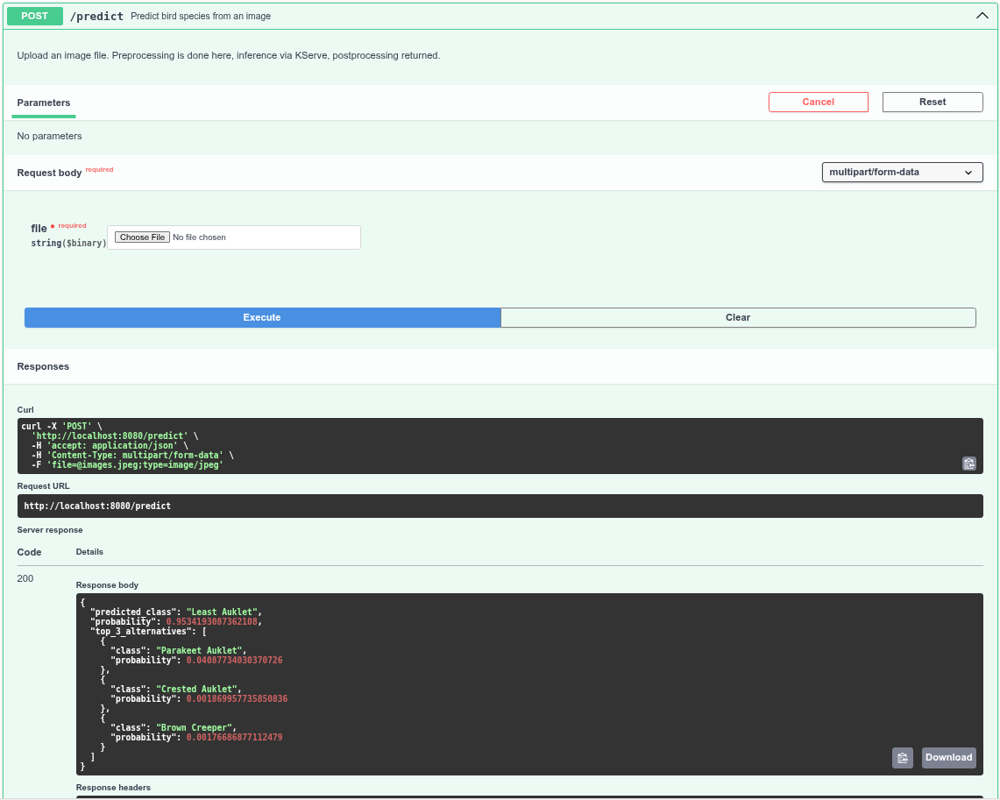

### Frontend (Streamlit)

A beautiful web UI for bird species classification with:

- Image upload (JPG/PNG) with drag-and-drop support
- Real-time classification results with confidence scores
- Top-3 alternative predictions with probability bars
- Custom gradient-themed CSS styling
- OpenTelemetry tracing on outgoing HTTP calls

The UI is shown in the screenshot below:

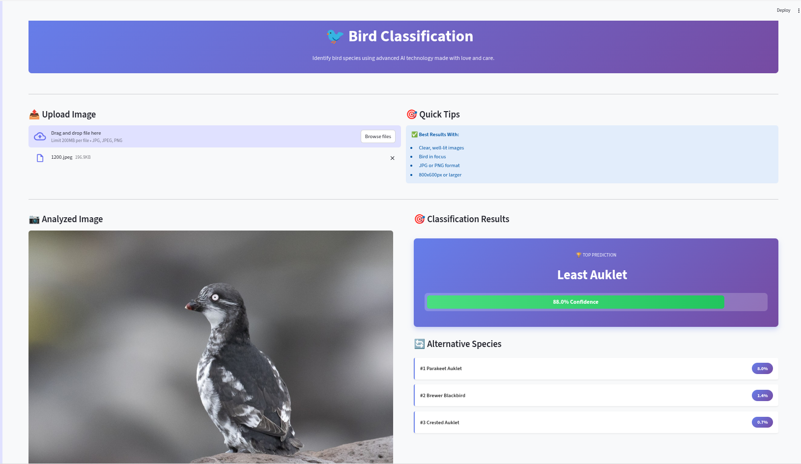

### Model Serving (KServe + TorchServe)

- **KServe InferenceService** with PyTorch predictor using the v2 inference protocol.
- **Autoscaling:** 0 to 3 replicas based on concurrent requests, with scale-to-zero after 900s idle.
- **Custom Handler** (`scripts/handler.py`): Resizes to 256px, center-crops to 224px, normalizes with ImageNet stats, runs inference in no-grad mode.
- **TorchServe Config:** Inference port 8085, management port 8090, metrics port 8082 (Prometheus mode), 1–5 workers, batch size 1, max batch delay 5s.

---

## Getting Started

### Prerequisites

- [Python 3.13+](https://www.python.org/)
- [uv](https://docs.astral.sh/uv/) (package manager)
- [Docker](https://docs.docker.com/get-docker/) & [Docker Compose](https://docs.docker.com/compose/)
- [Helm](https://helm.sh/) (for Kubernetes deployment)
- [gcloud CLI](https://cloud.google.com/sdk/docs/install) (for GCP infrastructure)

### Local Development with Docker Compose

1. **Clone the repository:**

   ```bash
   git clone https://github.com/vuniem131104/Fine-grained-Recognition-with-ViT.git
   cd Fine-grained-Recognition-with-ViT
   ```

2. **Create a `.env` file** with the required environment variables (see [Environment Variables](#environment-variables)).

3. **Start all services:**

   ```bash
   docker compose up --build
   ```

   This starts:
   - **PostgreSQL** on port `15432` (optional if you use Cloud SQL for MLflow backend)
   - **API** (FastAPI) on port `8000`
   - **Frontend** (Streamlit) on port `8501`

4. **Create model_predictions table in PostgreSQL:**

   ```bash
   python3 utils/create_prediction_table.py
   ```

5. **Access the application:**
   - Frontend: [http://localhost:8501](http://localhost:8501)
   - API docs: [http://localhost:8000/docs](http://localhost:8000/docs)

### Environment Variables

See `.env.example` for the required environment variables. Copy it to `.env` and fill in the actual values.

---

## Training

Model training is performed in the Jupyter notebook at `notebooks/birds_classification.ipynb`.

1. **Install development dependencies:**

   ```bash
   uv sync --group dev
   ```

2. **Download dataset:**
    - You can download the CUB-200-2011 dataset from [here](https://data.caltech.edu/records/20098) and place it in a local directory `data/`.
    - The folder structure should be:
      ```
      data/
        └── CUB_200_2011/
            ├── images/
            │   ├── 001.Black_footed_Albatross/
            │   ├── 002.Laysan_Albatross/
            │   ├── 003.Sooty_Albatross/
            │   ├── 004.Groove_billed_Ani/
            │   ├── 005.Crested_Auklet/
            │   └── ... (200 thư mục loài chim)
            ├── README
            ├── bounding_boxes.txt
            ├── classes.txt
            ├── images.txt
            └── train_test_split.txt
      ```
3. **Run Cloud SQL Proxy (optional):**
   - If you are using a local PostgreSQL instance, skip this step.
   - However, I recommend you to use Cloud SQL Proxy. Please run the Cloud SQL Proxy with the appropriate connection string.

  ```bash
  cloud-sql-proxy --port $POSTGRES_PORT ${PROJECT_ID}:${ZONE}:${SQL_INSTANCE_NAME}
  ```

4. **Run MLflow Tracking Server:**
   - Run this command in the terminal to start the MLflow tracking server with PostgreSQL backend and GCS artifact storage:

   ```bash
   mlflow server
      --backend-store-uri postgresql://${POSTGRES_USER}:${POSTGRES_PASSWORD}@${POSTGRES_HOST}:${POSTGRES_PORT}/${MLFLOW_DB}
      --default-artifact-root gs://${MLFLOW_BUCKET_NAME}/
      --host 0.0.0.0
      --port 5000
      --allowed-hosts "*"
    ```

5. **Run the training notebook:**
   - The notebook downloads the CUB-200-2011 dataset, applies data augmentation, fine-tunes the ViT-B/16 model, and logs the experiment to MLflow.
   - After training, the best and last model weights are saved as `.pth` files and located in the `models/bird_classification/` directory.
   - Best model weights are saved and registered in the MLflow model registry.

6. If you don't want to run the training yourself, you can use the pre-trained weights in this link: [ViT-B/16 CUB-200-2011 Weights](https://drive.google.com/file/d/1M33av4gzCcWsUkab_ji4e51wOEDxAB8Z/view?usp=sharing). Download and place the `best.pth` file in `models/bird_classification/` for the next steps. After that, run necessary cells in the notebook to infer the model with some test images.

---

## Model Packaging (MAR Archive)

The `scripts/build_torchserve_file.sh` script creates a TorchServe Model Archive (.mar) from the trained model:

```bash
bash scripts/build_torchserve_file.sh
```

This script:
1. Queries the MLflow PostgreSQL database for the model source path
2. Downloads the `.pth` weights from GCS and pushes it to `models/bird_classification/`
3. Creates a `.mar` archive using `torch-model-archiver` with the custom handler and model definition
4. Uploads the config and model-store to GCS for KServe to fetch
5. If you don't want to run the script, you can use the pre-created MAR archive in this link: [ViT-B/16 CUB-200-2011 MAR Archive](https://drive.google.com/file/d/1kMpB-tmyRp-r1Kq9ACVjI5RZksVPH2uC/view?usp=sharing). Download and place the `bird_classification.mar` file in `models/bird_classification/model-store/`. The next step is to push `models/bird_classification/model-store/` and `models/bird_classification/config/` to GCS (you can use `gsutil cp -r` command) so that KServe can fetch the model and config during deployment.

```bash
gcloud storage cp models/bird_classification/config/ "gs://${MODEL_BUCKET_NAME}/bird_classification/v1/" --recursive
gcloud storage cp models/bird_classification/model-store/ "gs://${MODEL_BUCKET_NAME}/bird_classification/v1/" --recursive
```

**Required `.env` variables:** `MLFLOW_BUCKET_NAME`, `MODEL_BUCKET_NAME`, `MODEL_NAME`, `MODEL_VERSION`, `POSTGRES_USER`, `POSTGRES_PASSWORD`, `POSTGRES_HOST`, `POSTGRES_PORT`, `MLFLOW_DB` credentials.

---

## Kubernetes Deployment

### Infrastructure Setup (GCP)

Provision all required GCP resources with:

```bash
bash scripts/create_gcp_infra.sh
```

This creates:
- **GCS Buckets:** Loki chunks, Loki ruler, MLflow artifacts, model storage, Tempo traces
- **Cloud SQL:** PostgreSQL 18 instance with MLflow and application databases
- **Service Accounts:** Loki, Tempo, Frontend, MLflow, KServe, GitHub Actions — each with Workload Identity bindings
- **Artifact Registry:** Docker repository for application images
- **GKE Autopilot Cluster:** Managed Kubernetes cluster

Create namespaces and secrets:

```bash
kubectl create namespace $PRODUCTION_NAMESPACE
kubectl create namespace $MONITORING_NAMESPACE
kubectl apply -f k8s/manifests/api-secret-example.yaml
kubectl apply -f k8s/manifests/grafana-secret-example.yaml
# Note: Remember to replace the example secrets with actual values before applying.
```

### Helm Charts

Eight Helm charts are provided in `k8s/helm/`:

| Chart        | Namespace         | Description                                                                   |
| ------------ | ----------------- | ----------------------------------------------------------------------------- |
| `api`        | aide-production   | FastAPI backend with Cloud SQL Proxy sidecar, HPA (1–3 pods, 85% CPU target), nginx Ingress |
| `frontend`   | aide-production   | Streamlit frontend with nginx Ingress                                        |
| `serving`    | aide-production   | KServe InferenceService (PyTorch predictor, autoscale 0–3 replicas)          |
| `grafana`    | aide-monitoring   | Dashboards (accumulated requests, model predictions)                         |
| `loki`       | aide-monitoring   | Log aggregation (GCS backend, 7-day retention)                               |
| `tempo`      | aide-monitoring   | Distributed tracing (GCS backend, 7-day retention)                           |
| `prometheus` | aide-monitoring   | Metrics collection with remote write API                                     |
| `alloy`      | aide-monitoring   | Grafana Alloy — pod log collection, OTLP trace/metric forwarding             |

**Deploy a chart:**

```bash
helm upgrade --install <release-name> k8s/helm/<chart> \
  --namespace <namespace> \
  --create-namespace \
  -f k8s/helm/<chart>/values.yaml
```

---

## CI/CD Pipeline

The GitHub Actions workflow (`.github/workflows/ci-cd.yml`) automates testing, building, and deployment:

```
Push/PR to master/main
        │
        ▼
┌─ detect-changes ─────────────────────────────────┐
│  Uses dorny/paths-filter to detect changes in    │
│  services/api/ or services/frontend/             │
└──────┬───────────────────────────┬───────────────┘
       │                           │
       ▼                           ▼
┌─ test-api ──────────┐   ┌─ build-push-frontend ─┐
│  pytest + coverage  │   │  Docker build & push  │
│  (≥80% threshold)   │   │  to Artifact Registry │
└──────┬──────────────┘   └──────┬────────────────┘
       ▼                         ▼
┌─ build-push-api ─────┐   ┌─ deploy-frontend ────┐
│  Docker build & push │   │  helm upgrade to GKE │
│  to Artifact Registry│   └──────────────────────┘
└──────┬───────────────┘
       ▼
┌─ deploy-api ────────┐
│  helm upgrade to GKE│
└─────────────────────┘
```

**Features:**
- Change detection to skip unnecessary builds
- Workload Identity Federation (keyless auth with GCP)
- Images tagged with short SHA + `latest`
- Automatic Helm upgrade on push to `master`/`main`

---

## Observability

Full **Grafana LGTM stack** for production monitoring:

| Component      | Role                                                                                      |
| -------------- | ----------------------------------------------------------------------------------------- |
| **Alloy**      | DaemonSet collector — discovers K8s pod logs → Loki, receives OTLP traces → Tempo, scrapes self-metrics → Prometheus |
| **Loki**       | Log aggregation with GCS backend and 7-day retention                                      |
| **Tempo**      | Distributed trace storage with GCS backend and 7-day retention                            |
| **Prometheus** | Metrics collection and remote write API                                                   |
| **Grafana**    | Visualization with custom dashboards for accumulated requests and model predictions       |

**Log↔Trace Correlation:** Both API and Frontend inject OpenTelemetry `traceID` and `spanID` into structured JSON logs, enabling seamless navigation between logs and traces in Grafana.

### Grafana Dashboards
1. **Accumulated Requests Dashboard:** Shows total number of prediction requests on a daily basis.

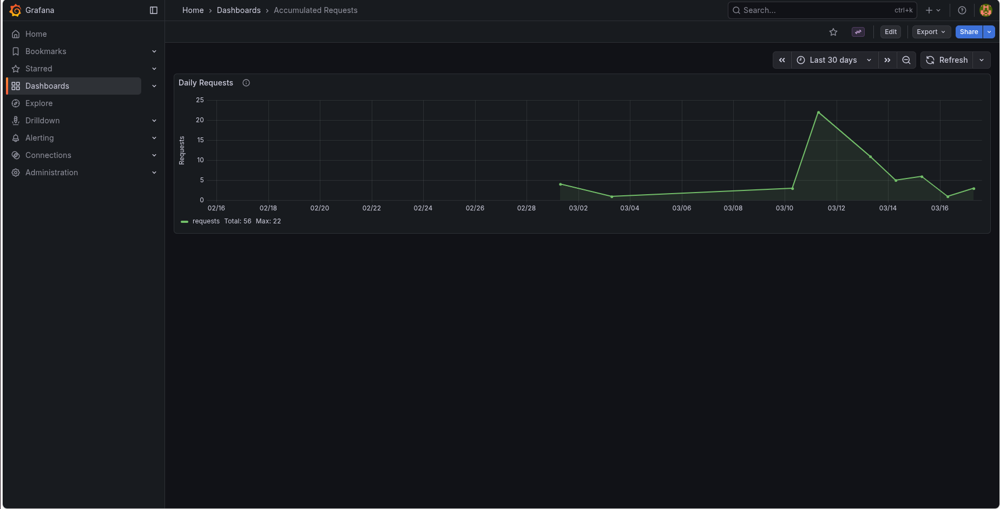

2. **Model Predictions Confidence Dashboard:** Displays recent predictions stored in PostgreSQL with their confidence scores, allowing monitoring of model performance and drift over time.

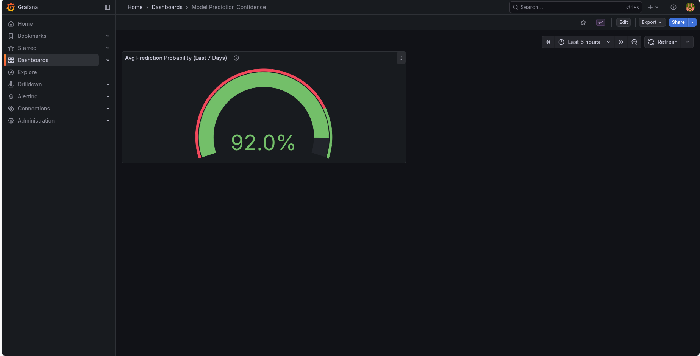

3. **Kubernetes Deployment Statefulset Daemonset metrics:** Shows the status of Kubernetes resources (pods, deployments, statefulsets, daemonsets) to monitor the health of the infrastructure.

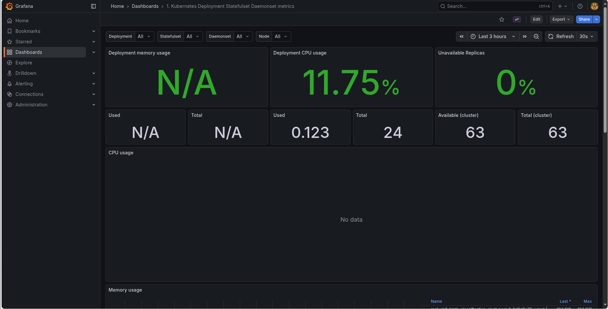

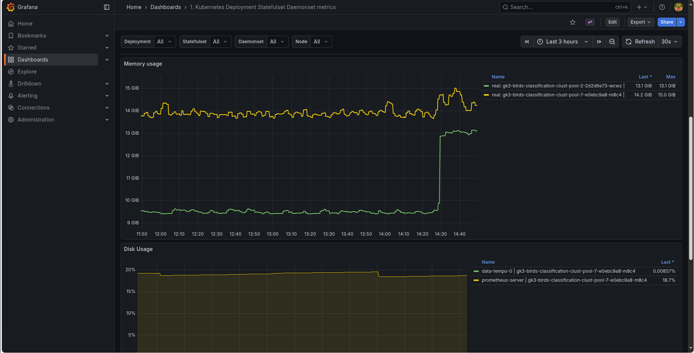

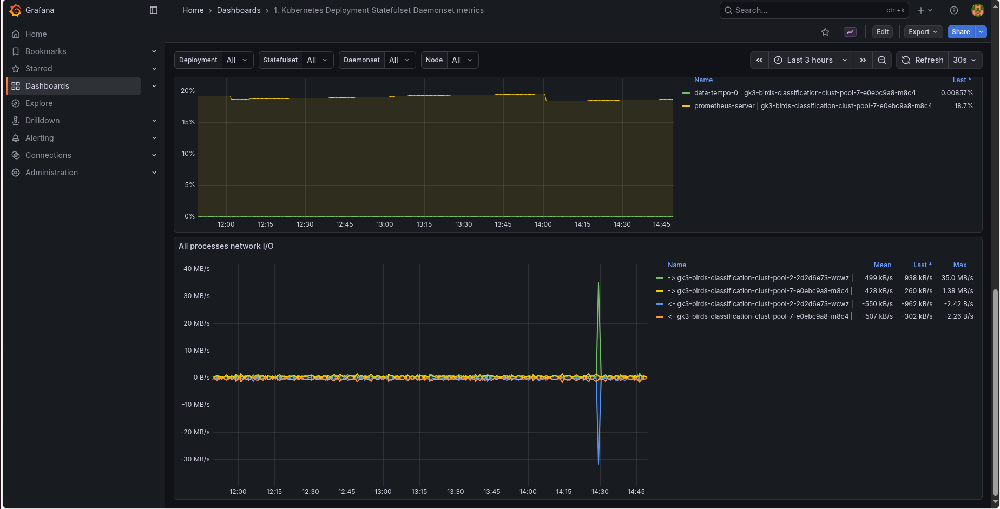

4. **Kube State Metrics V2:** Provides detailed metrics about Kubernetes objects (pods, deployments, statefulsets, daemonsets) for monitoring and alerting.

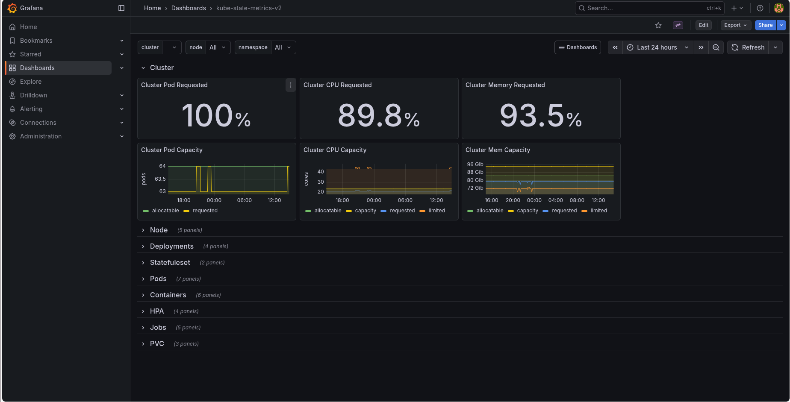

5. **Prometheus 2.0 Overview:** Displays the overall health and performance of the Prometheus server, including scrape durations, rule evaluations, and alerting status.

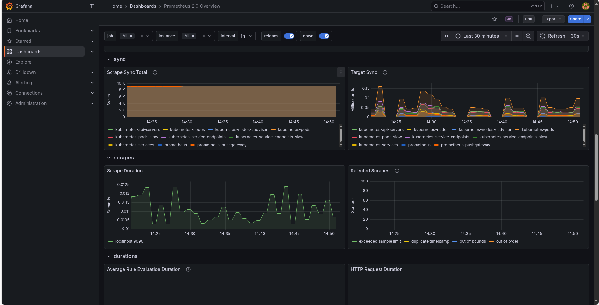

### Loki Log Queries

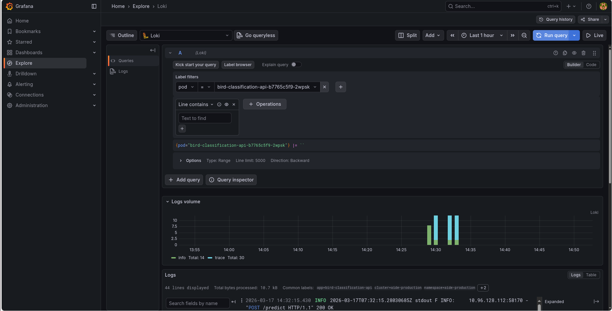

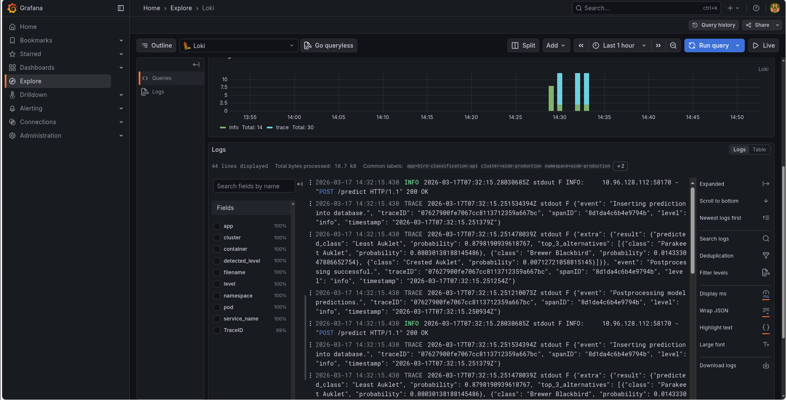

# Tempo Trace Queries

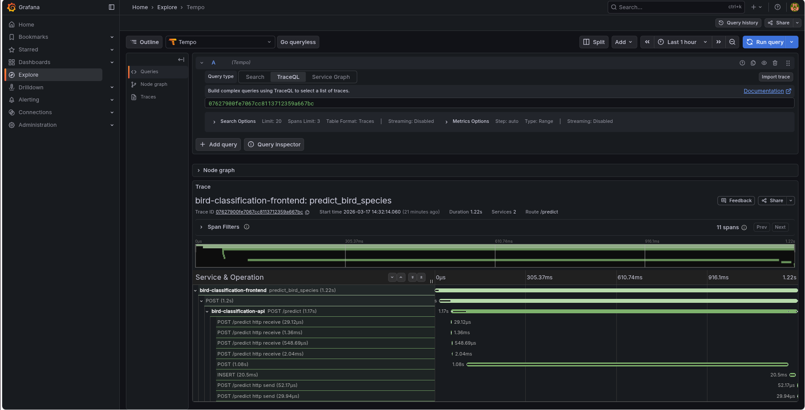

---

## Testing

Run API unit tests with coverage:

```bash
cd services/api
uv run pytest tests/ \
  --cov=src/api \
  --cov-report=term-missing \
  --cov-fail-under=80 \
  -v
```

Test coverage includes:
- Prediction postprocessing logic
- Database insertion
- Health check (service up/down)
- Full predict workflow (end-to-end mock)
- Invalid image upload handling
- KServe timeout and HTTP error handling

---

## Database Schema

Predictions are stored in PostgreSQL for analytics and monitoring:

```sql
CREATE TABLE model_predictions (
    id              SERIAL PRIMARY KEY,
    base64_image    TEXT,
    probability     FLOAT,
    predicted_class VARCHAR(255),
    alternatives    JSONB,
    created_at      TIMESTAMP DEFAULT CURRENT_TIMESTAMP
);
```

---

## License

This project is for educational and research purposes.